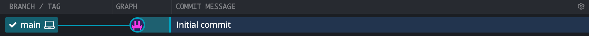

# The Basics of Git

Now that you're all set up we can get started! When using Git you store your
code in _repositories_, directories with a special, hidden directory inside
called `.git`. In `.git`, git stores the information needed to keep track of the
changes you make in the rest of the directory.

## Creating your first repository

Open up gitKraken and initialize a new repository somewhere! In gitKraken you
can use !kbd[!ctrl+T] to switch to a new tab, and !kbd[!ctrl+I] to start
initializing a repo. For now, you can ignore `.gitignore` and `LICENSE`, just
give your repo a name and location. Now you should find a screen with a whole
mess of things in it, in the middle, you'll find the tracked changes in your
repo. For now, there should only be one called _Initial commit_.



Use the shortcut !kbd[!ctrl+Shift+E] and you should be able to open the
repository in an editor (You may have to set up which editor to use first, in
which case GitKraken will guide you). In the editor, you should see one file
`README.md` which is a file commonly used to describe the contents of the repo.

## Your first commit

Onto your first change! In Git your changes are grouped into a _commit_. While
you're working on your files the basic idea is that you commit each time you
want to save a state you might want to come back to in the future. In the
beginning, while you're still learning, this might be each time you and your lab
partner feel done for the day. Over time, as you get more used to version
control, you'll probably find yourself committing more often, each time you make
a meaningful change. A good rule of thumb is to commit your changes each time
you start something new. In a typical lab assignment, it could be a good idea to
commit each time you've finished a task of that assignment.

With your repository open in your editor, create a new file and add some
content! For example, you could add a file `Main.hs` and add:

```haskell
main = putStrLn "Hello, Git!"
```

If you then open GitKraken it should have detected your change!


View the change and you'll see a panel where you can build your next commit. To
add the code to your next commit, stage that file. You can then continue writing
code if you want, and stage these changes as well. When you feel happy with your
staged changes you can add a commit message describing what you've done and
commit. You've now saved the change and created a snapshot which you can jump
back to at any time!

It is important to note, that only the changes you stage get added to the
commit. The basic idea is that a file change can be in one of three places:

1. On your system only, in Git speak these changes lie in your _Working Directory_.
2. Staged to be added to the next commit, these are local changes visible to
   only you. They haven't been committed yet, but are marked to be committed
   soon. These changes lie in what Git calls the _Index_.
3. Committed, these changes have been saved in your history. The state
   containing all the changes up to the latest commit is called _HEAD_.

The life of a file is basically: _Working directory_ → _Index_ → _Head_.

That's all there is to a commit! Test yourself! Can you add the following to
`Main.hs` and commit the change as _Add type signature to main_?

```haskell
main :: IO ()
main = putStrLn "Hello, Git!"
```

> **A note on commit messages**
>
> At times you might feel the urge to write commit messages like: _"did some
> stuff"_ or _"did the assignment"_. While these are fine for the time being,
> your message should summarize what you did. A good commit message describes in
> a few words what was done in that commit. Some examples of good commit
> messages are _"first draft of section 5 in report"_ or _"add function
> getContent to Main.hs"_
>
> If you can't sum up your commit in one sentence, you've probably created a too
> large commit!