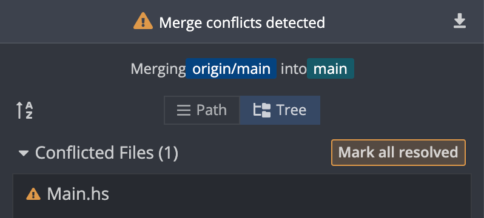
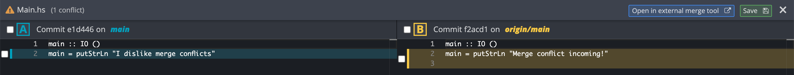

# Putting your repo on GitHub/GitLab

You've now gotten to the point where you can work along quite well on your own.
Writing changes, staging them and committing from time to time. But what good is
working all on your own? And wouldn't it be nice having a backup of your
repository just in case? This is where _remotes_ come in, online locations where you can store your
repository. 

> **An important note on public vs private repositories**
> Make sure that repos you use for Lab assignments and projects are private.
> Having solutions for these publicly available is considered cheating.

### VSCode
If you followed our last chapter in setting up a git repository we
are now presented with a new button once all changes have been commited. It
will say `Publish Branch`. If you press on this you'll most likely be prompted
to sign into GitHub. If you haven't done so already this is the point you'll be
forced to set up two factor authentication as well. If you want to use GitLab
we suggest creating the repository on GitLab first and cloning it instead if
you do not want to use the termnial. 

Once this is all done, upon pressing Publish Branch again the command palette
will get a small dropdown asking if you want to publish to GitHub private
repository or a GitHub public repository. For all of your school projects you
must use private, and for something like this we suggest doing so as well. 
If you now sign into GitHub you'll be able to see your repo there! 


### Terminal 
To put our repository on a remote through the terminal we first have to create
a repository on our remote. This is because we don't have any integration like
GitHub has with VSCode. The advantage however is that this works in the exact
same way on every single remote. Be it GitHub, GitLab, BitBucket, they can all
be added like this. I'll be using GitHub for the time being. So go onto your
remote and create a new repository. Give it a name, make sure it's private and
create the repository. Once you´re here GitHub actually goes through both how
to create a repository and how to push an existing repository. We're going to
choose the latter.

So now write in these commands: 
```bash
git remote add origin git@github.com:{YourUser}/{YourRepo}.git
``` 
`origin` here is simply the name for the remote. If you don't have a specific
reason to name it something else, keep it as origin. 
```bash
git branch -M main
``` 
`-M` is a flag which renames your current branch, most often to main if it is
not called that already. 
```bash
git push -u origin main
```
And this finally pushes our commit onto our remote for the first time and sets
the "upstream branch", basically where our remote branch starts. 
<!-- I feel like this entire section was written poorly-->

## Syncing
Now that you have a remote and local repository a problem arises. How do we sync
between the two? Git uses a system where you _push_ and _pull_ changes between
your local and remote repositories. Whenever you want to add changes from your
local to the remote, you _push_ these changes. Similarly, whenever you have some
changes in the remote that you wish to have on your local, you _pull_ these
changes. In VSCode there are several ways to do this. The easiest is using the
command palette. In command mode (!kbd[!ctrl+shift+P]) and writing `git pull`
and `git push` respectively. Funnily enough this is exactly how you do it in
the terminal as well. You use `git pull` and `git push`. 

If you really really wanna use your mouse they're a little more hidden away. In
the left source control bar you can press on the three small dots next to
either your repository or the changes dropdown. Otherwise further down you will
see a separate menu titled `Graph`. Next to this you can find push and pull
buttons as well.

Try adding a commit to your example repository and push this commit to your
remote. If you then go to your remote repo, you should see your new commit there!

### Cloning
Now a big reason for having a remote repository is to be able to share your code
with a collaborator, or lab partner. Our recommended way is for all
collaborators to _clone_ the remote repo. When you clone a repo, it is
automatically set up to have the proper remote.

### VSCode
If you want to clone a repository from GitHub in VSCode you can either search
for `Git clone` in the command palette, or if you are in no folder at all and
go to the source control menu you will be presented with the option to clone a
repository. Here you can either search for a public repository or paste in a
SSH "link" for a private repository. To find this "link" go to the repository
in GitHub or GitLab and press the button labeled `Code`. It's colored in both
so it's easy to spot. Here you get a small dropdown and can select SSH.

### Terminal
In the same way as above, go to the remote remote and find the SSH link. Then in your terminal write 
```bash
git clone git@github.com:{YourUser}/{YourRepo}.git
```

# Causing, and resolving merge conflicts

As always, when trying to sync things, problems might arise. What happens if you
and a buddy have both made commits to the same file, and both try to push? The
first push will go through just fine, but the second will be greeted with an
error, there are newer commits on the remote, not present on the local! The
second person will then have to _pull_ before pushing. If you haven't touched
the same files Git will just add the commits together and you'll be ready to
push right away. However! If you have made conflicting commits to the same file
you will have to solve a _merge conflict_. Merge conflicts arise when the remote
and local cannot sync (or when two branches are unable to merge, but we'll get
to that later).

Here's a recipe for causing your first merge conflict!

1. Grab a buddy and have them clone your example repo (Or if there is no buddy
   readily available clone your example repository to a second location on your
   computer).
2. Both make commits changing the same file, e.g. one of you could change `Main.hs` to
   ```haskell
   main :: IO ()
   main = putStrLn "Merge conflict incoming!"
   ```
   While the other changes it to,
   ```haskell
   main :: IO ()
   main = putStrLn "I dislike merge conflicts"
   ```
3. Now both try to push! You'll find that one push succeeds and the other fails.
4. Pull to the local repo that failed to push, congratulations you now have a
   merge conflict to solve!

<!-- Now that you have a merge conflict, let's solve it! You'll find that GitKraken -->
<!-- has found a list of the conflicting files in the panel to the right, click one -->
<!-- of them! -->
<!--  -->
<!-- Clicking the file will allow you to pick which version of each row to keep! -->
<!--  -->
<!-- But before choosing which row(s) to keep, it is worth looking at what your file -->
<!-- looks like now. Open your file and you'll find that it looks something like -->
<!-- this: -->

```haskell
main :: IO ()
<<<<<< HEAD
main = putStrLn "I dislike merge conflicts"
======
main = putStrLn "Merge conflict incoming!"
>>>>>> main
```

This scary mess marks where the conflict in your file has occurred. There may be
several of these in one file. They begin with `<<<<<< current version`, which
outlines what is currently the latest committed version of that row, after that
version, there's `=========` which outlines the other version of that row.
Finally, the end of the conflict is marked with `>>>>>> incoming version`.

There are two easy ways to solve the conflict.

<!-- 1. In GitKraken, click the file with conflicts and choose the rows as you wish. -->
<!--    Keep in mind that you can pick and choose from both changes, and add -->
<!--    additional rows as well. -->
2. Or you could open the file in your editor. Write what you want the merged
   result to look like, making sure to remove all the tags. When the file
   contains what you want it to contain go back to GitKraken and mark that file
   as resolved.

The resolved file for the above could look something like this:

```haskell
main :: IO ()
main = putStrLn "I dislike merge conflicts"
```

Or, if you wanted to keep both prompts it could be:

```haskell
main :: IO ()
main = do
  putStrLn "I dislike merge conflicts"
  putStrLn "Merge conflict incoming"
```

When all the files are resolved, all you have to do is commit. Git should have
pre-made an appropriate git message for you. Congrats! You've just solved your
first merge conflict.

> **A note on force pushes**
>
> When trying to push to a remote repo which has newer commits missing on the
> local, Git will give you two suggestions
>
> 1. The sensible thing is to pull, solve eventual merge conflicts and then
>    push.
> 2. Or, you can do a force-push. **_Never_**, I repeat, **_never_**, take this option.
>    Force push overwrites your buddies work with your own. It does not attempt
>    to merge your different commits, but rather just overwrites the remote with
>    your local version. This will inevitably cause headache for your buddy the
>    next time they pull, as well as possibly remove their work.
