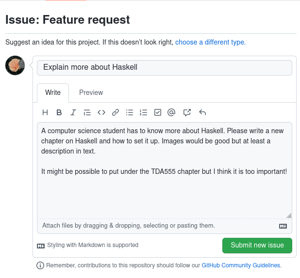

# Contributing

Nice, you have decided that something is missing or should be expanded upon, or perhaps just want to fix a typo. The instructions are written with the expectation that you are at least somewhat familiar with setting up a development environment. If you do not feel up to the task you should try and contact the study board at your division as they should know how to get in touch with the authors.

## Request changes

If you have feedback you can file an [issue](https://github.com/toasterbag/data101/issues) on GitHub. If you have a GitHub account this is an easy process!

To do it you will select **New issue** on [this page](https://github.com/toasterbag/data101/issues) and then press **Get started** on _"Feature request"_. You can then fill out the template, remember to put a descriptive title of what you want and describe why you want it. Here is an example request.

## Installation

To set up the development environment, you first of all need [mdBook](https://rust-lang.github.io/mdBook/guide/installation.html) installed.

Now `cd` into `preprocessor` and run `cargo build --release` which will build our custom preprocessor.

You should then be able to open the book by running `mdbook serve --open` in the project root, which will open the web page and dynamically update as you edit it.

## Contributing

To start editing pages you just have to edit the files in the ´src´ directory. The pages are written in Markdown, if you are unfamiliar with it I recommend reading [this](https://rust-lang.github.io/mdBook/format/markdown.html).

When you are done, you should open a pull request on the Data101 GitHub page and describe what you have changed. You may then receive feedback on your edit if there is something that has to be changed, it will then be merged with the project and reflected in the actual book!

## Modifications to mdBook

To better support the flow of the book some modifications have been made. All modifications in the `theme` directory can be found by searching for `BEGIN DAT101`.

### Operating system specific content

To remove unnecessary information for some readers you can apply CSS classes to hide content for readers not using the specified os. The syntax is `{{ .macos }}`. See this in action on the Git page. You can use `windows`, `linux` or `macos`. This will hide the section from those using other operating systems. This is useful when describing installation processes.

You can also use `{{begin .<os>}}`

### Programme specific content

You can also use the same syntax as above to hide content from other programmes. The possible identifiers are `Data`, `ÌT` and `DV`.

### Keyboard shortcuts

To write keyboard shortcuts, use the !kbd command. For example like this `\!kbd[!ctrl+B]`. `!ctrl` is a special command that can be used within !kbd, and it gets replaced with `Ctrl` or `⌘` depending on the operating system the user chooses.

### Inlining icons

You can include icons as well, use `\!icon[icon]` to display a windows icon. Any icon from [Font Awesome](https://fontawesome.com/search?s=solid%2Cbrands) can be used.

## Things to keep in mind

- To remain consistent, use British English.
- If you are adding new pages or writing about new technologies, remember to also add an entry in the glossary and hyperlink to it. Examples of this can be seen on the introduction page. You should only hyperlink the first instance of the word.

## Deploying

This book is automatically deployed using GitHub Actions. Any change pushed to the `main` branch is compiled and uploaded to `https://data101.dtek.se`.
